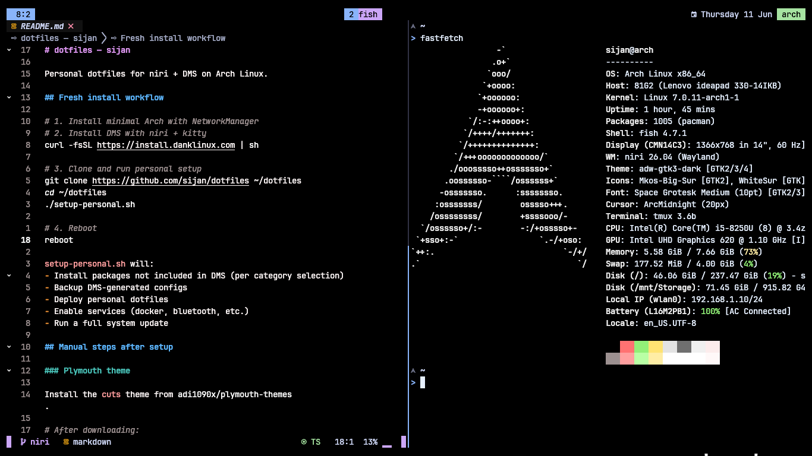

# Personal Niri+Arch minimal setup

<p align="center">
  
</p>

Personal dotfiles for niri + DMS on Arch Linux.

## Fresh install workflow

```bash
# 1. Install minimal Arch with NetworkManager
# 2. Install DMS with niri + kitty
curl -fsSL https://install.danklinux.com | sh

# 3. Clone and run personal setup
git clone https://github.com/sijan/dotfiles ~/dotfiles
cd ~/dotfiles
./setup-personal.sh

# 4. Reboot
reboot
```

`setup-personal.sh` will:
- Install packages not included in DMS (per category selection)
- Backup DMS-generated configs
- Deploy personal dotfiles
- Enable services (docker, bluetooth, etc.)
- Run a full system update

## Manual steps after setup

### Plymouth theme

Install the `cuts` theme from [adi1090x/plymouth-themes](https://github.com/adi1090x/plymouth-themes).

```bash
# After downloading:
sudo cp -r cuts /usr/share/plymouth/themes/
sudo plymouth-set-default-theme cuts
sudo mkinitcpio -P
```

### Limine bootloader

Copy the limine config from this repo and update the PARTUUID:

```bash
# Get your root partition UUID
blkid /dev/sda2 -s PARTUUID -o value

# Edit the placeholder in the repo file, then copy
sudo cp ~/dotfiles/.config/system/limine.conf /boot/limine/limine.conf
```

### fstab

Copy the fstab template and update the UUIDs:

```bash
# Get your partition UUIDs
blkid /dev/sda1 -s UUID -o value   # boot
blkid /dev/sda2 -s UUID -o value   # root
blkid /dev/sdb  -s UUID -o value   # storage

# Edit .config/system/fstab and replace each <CHANGE-ME-*> placeholder,
# then copy to /etc/
sudo cp ~/dotfiles/.config/system/fstab /etc/fstab
```

## Reducing boot time

Check current boot time:

```bash
systemd-analyze
```

This system averages ~12.8s (firmware 3.3s + loader 0.9s + kernel 3.4s + userspace 5.1s).
Biggest userspace hitters are `libvirtd` (~880ms), `systemd-userdbd` (~980ms), `systemd-journal-flush` (~700ms).

### Delaying non-essential services

Services like libvirtd, accounts-daemon, and upower don't need to start at boot.
Delay them with a drop-in:

```bash
sudo mkdir -p /etc/systemd/system/libvirtd.service.d
sudo tee /etc/systemd/system/libvirtd.service.d/delay.conf <<'EOF'
[Service]
ExecStartPre=/usr/bin/sleep 5
EOF
```

Or disable them entirely and start on demand:

```bash
sudo systemctl disable libvirtd upower accounts-daemon
sudo systemctl mask systemd-userdbd
```

### Disable watchdog timers

Watchdog modules add ~1-2s to kernel boot time. Disable if not needed:

```bash
echo "nowatchdog" | sudo tee -a /etc/kernel/cmdline
# Then regenerate: sudo mkinitcpio -P (or update limine.conf)
```

### Use volatile journals

Avoid the `systemd-journal-flush` delay by keeping journals in RAM:

```bash
sudo mkdir -p /etc/systemd/journald.conf.d
sudo tee /etc/systemd/journald.conf.d/volatile.conf <<'EOF'
[Journal]
Storage=volatile
EOF
```

### Reduce udev settle time

```bash
sudo mkdir -p /etc/systemd/system/systemd-udev-settle.service.d
sudo tee /etc/systemd/system/systemd-udev-settle.service.d/override.conf <<'EOF'
[Service]
TimeoutSec=3
EOF
```

## Adding packages

Add package names (one per line) to the appropriate `.txt` file in `.config/setup/packages/`. Lines starting with `#` are ignored.
